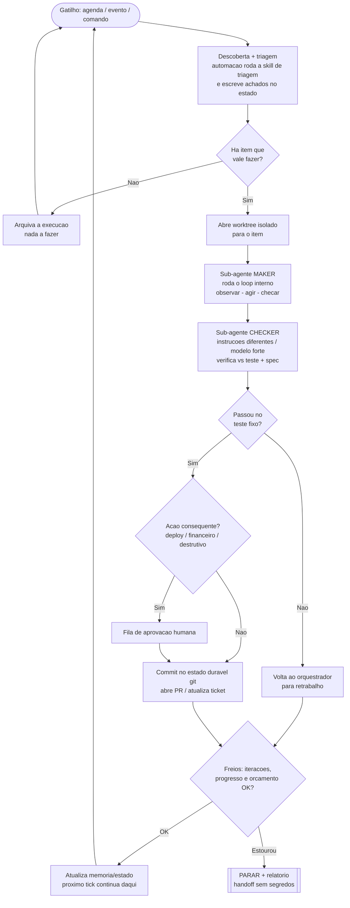

# ENGINEERING_LOOP.md — Protocolo Universal de Loop de Engenharia (v2.0)

> **Versão:** 2.0 · **Atualizado em:** 30/06/2026 · **Dono:** Flavio · **Escopo:** global (todos os projetos, todas as IAs) · **Substitui:** v1.0
> **Origem da v2.0:** incorpora a disciplina de *loop engineering* (Addy Osmani, 07/06/2026), as posições de **Boris Cherny** (líder do Claude Code) e **Peter Steinberger**, a técnica *Ralph* (Geoffrey Huntley) e os padrões de agente da **Anthropic** ("Building Effective Agents"). A v1.0 descrevia bem o **loop interno** (como um agente trabalha numa tarefa). A v2.0 adiciona o **loop externo** — o sistema autônomo que faz os agentes trabalharem por você. É código crítico do seu processo: versione e registre mudanças no `AI_MASTER_LOG.md`.

---

## 0. O que entrou na v2.0

- A pilha de alavancagem **prompt → contexto → loop** e onde você atua hoje.
- O princípio mestre: **um loop é uma tarefa COM um teste.**
- A distinção **loop interno × loop externo** (a peça que faltava).
- Os **5 blocos de um loop auto-executável + memória**, mapeados ao seu stack.
- **Maker–checker** (= a sua auditoria cega, agora formalizada).
- Os **padrões de orquestração da Anthropic** e quando usar cada um.
- Os **três freios obrigatórios** (incluindo teto de gasto em tokens/R$).
- A **escada de maturidade** para adotar com segurança.
- O **template universal do loop externo** para colar em qualquer IA.
- **Quando NÃO usar um loop** ("just talk to it"), a **economia do loop** e os **riscos que o loop não resolve.**

---

## 1. A pilha de alavancagem: prompt → contexto → loop

Cada camada embrulha a de dentro e move o ponto de alavancagem para mais longe da chamada crua do modelo. Nenhuma some — um prompt ruim dentro de um loop só produz trabalho ruim mais rápido.

| Camada | O que você otimiza | Unidade de trabalho |
|---|---|---|
| **Prompt engineering** | como você redige uma instrução | um turno que você digita à mão |
| **Context engineering** | o que mais está na janela: docs, histórico, defs de tools | as condições em torno de uma resposta |
| **Loop engineering** | o sistema que decide *o que* prompar, *quando* e *se o resultado passa* | um ciclo auto-executável por muitos turnos |

Cherny (Claude Code) resume a mudança: "meu trabalho é escrever loops." Steinberger: pare de prompar agentes; projete os loops que prompam os agentes. **A alavanca mudou; o trabalho não ficou mais fácil** — um loop bem desenhado multiplica um bom engenheiro; um mal desenhado multiplica uma decisão ruim com menos você olhando.

---

## 2. Princípio mestre: um loop é uma tarefa COM um teste

A frase que governa tudo: **uma tarefa sem teste é só esperança.** Um loop útil tem sempre um *teste fixo e mecânico* que diz, sem opinião, se o trabalho melhorou.

É por isso que "melhore o código" falha e "toda página carrega em menos de 50ms sob o mesmo teste" funciona: a segunda tem uma linha de chegada que o agente roda após cada mudança. **No seu protocolo, o *Definition of Done* (DoD) deixa de ser uma lista de boas intenções e vira um teste que dá verde ou vermelho.**

---

## 3. Loop interno × loop externo (a distinção que faltava)

- **Loop interno** — o ciclo que o agente já roda a cada turno: percebe o estado, raciocina, age (chama tool, edita arquivo, roda teste), observa o resultado e raciocina de novo. **Você não constrói isso; o harness (Claude Code, Cowork, Cursor…) faz.** É o ciclo de 6 fases da §4.
- **Loop externo** — o sistema que você projeta: ele roda o loop interno numa **cadência**, alimenta com trabalho, **checa** o resultado e **decide** o próximo passo, sem você digitar cada prompt. Tudo da §5 em diante é sobre desenhar bem esse loop externo.

### Diagrama do loop externo (orquestração)



---

## 4. [INTERNO] As 6 fases de uma iteração

Mantidas da v1.0. O agente percorre, em ordem, e a fase atual fica em `TAREFA_ATUAL.md`:

**ORIENTAR** (lê `CLAUDE.md`, `AI_MASTER_LOG.md`, `CONTEXT_SNAPSHOT.md`, `TAREFA_ATUAL.md`; reancora no código real) → **PLANEJAR** (parágrafo de arquitetura + menor passo + critérios de aceite + arquivos + riscos) → **EXECUTAR** (código completo, sem placeholder; `try/catch` + feedback) → **VERIFICAR** (build + lint + testes/evals; formatação BR; **o teste FIXO decide, não a opinião do agente**) → **REGISTRAR** (atualiza `TAREFA_ATUAL.md` + `AI_MASTER_LOG.md` + `SESSAO_NNN` + `BUGS_LOG.md`; roda o link-checker) → **DECIDIR** (DoD fechou? continua, para e escala, ou encerra no gate).

**Reforço da v2.0:** a fase VERIFICAR agora exige um **teste mecânico fixo** (o "Check"). "Parece pronto" não conta.

---

## 5. [EXTERNO] Anatomia de um bom loop: 5 coisas explícitas

Todo loop confiável nomeia cinco coisas. Faltou uma, ele deriva, roda para sempre ou "tem sucesso" com os testes vermelhos.

| Parte | Pergunta que responde | Falha se faltar |
|---|---|---|
| **Gatilho** | Quando o loop roda? | Nunca começa, ou roda na hora errada |
| **Entradas** | Que estado fresco o agente inspeciona a cada passada? | Age sobre suposições velhas |
| **Ação** | Qual única mudança limitada e reversível ele pode fazer? | Raio de dano enorme, impossível desfazer |
| **Teste** | Que teste/benchmark/rubrica fixo decide o sucesso? | "Parece pronto" enquanto está quebrado |
| **Parada** | Sucesso? Nada a fazer? Bloqueado? Sem orçamento? | Loop infinito, tokens torrados, autoridade desgovernada |

**As 4 regras de design:** (1) comece com uma **meta mensurável**; (2) mantenha cada **ação pequena** (uma mudança reversível por vez); (3) use um **teste fixo** rodado igual após cada mudança; (4) **defina como para** (sucesso, no-op, pedir-aprovação, bloqueado/sem-orçamento — todos escritos).

---

## 6. [EXTERNO] A condição de parada como contrato

Uma meta só vale o que a evidência que a prova. Especifique quatro coisas:

| Dimensão | Um desejo (não) | Um contrato (sim) |
|---|---|---|
| **Estado-final** | "Melhorar a cobertura de testes" | "Cobertura de `src/financeiro` ≥ 90%" |
| **Evidência** | "Parece pronto" | "`npm test` sai 0 e o relatório de cobertura confirma o número" |
| **Restrições** | *(não dita)* | "Não tocar em APIs públicas nem apagar testes existentes" |
| **Orçamento** | *(ilimitado)* | "Pare após 25 turnos ou R$ 25, o que vier primeiro" |

Três hábitos tornam o loop confiável: **preserve os erros** (para o loop aprender, não repetir), **embuta a verificação no loop** (não a parafuse depois) e **trate o teste vermelho / CI vermelho como o sinal que mantém o agente honesto.**

---

## 7. [EXTERNO] Os 5 blocos de um loop auto-executável + memória

Um ano atrás isso era uma pilha de bash que você mantinha pra sempre. Hoje as peças vêm dentro dos produtos, e a forma é a mesma no Claude Code e no Codex — então você para de discutir ferramenta e projeta um loop que roda em qualquer uma.

| # | Bloco | Função no loop | No seu mundo (Claude Code / Cowork) | Em outras IAs (Codex / Cursor) |
|---|---|---|---|---|
| 1 | **Automações** | descoberta + triagem em cadência (a batida do coração) | `/loop` (re-roda em cadência), `/goal` (roda até a condição ser verdadeira), tarefas agendadas/cron, hooks, GitHub Actions | aba Automations + `/goal`; Cursor Automations |
| 2 | **Worktrees** | isolar agentes paralelos para não colidirem | `git worktree`, flag `--worktree`, `isolation: worktree` num subagente | worktree por thread (Codex) |
| 3 | **Skills** | conhecimento do projeto escrito uma vez (não re-explicar) | suas Agent Skills: `base-projeto-doc`, `motor-ia-disciplina`, `prompt-master`, `rebuild-readiness` — e **este protocolo empacotado como skill** | `SKILL.md` / `AGENTS.md` |
| 4 | **Connectors / MCP** | tocar suas ferramentas reais (banco, ticket, deploy, Slack) | seus MCPs: Supabase, Vercel, Gmail, Slack, Stripe, Notion, etc. **Prefira CLIs quando der** (um MCP pesado pode comer ~23k tokens de contexto) | MCP + plugins |
| 5 | **Sub-agentes** | separar quem faz de quem checa | `.claude/agents/`, agent teams | TOML em `.codex/agents/` |
| + | **Memória** | estado durável entre execuções | `AI_MASTER_LOG.md`, `TAREFA_ATUAL.md`, `CONTEXT_SNAPSHOT.md`, `BUGS_LOG.md`, `SESSAO_NNN` (markdown no git) | markdown / Linear via MCP |

**Memória é a espinha.** O modelo esquece tudo entre execuções, então o estado precisa viver **em disco**, não no contexto. *O agente esquece; o repositório não.* (É exatamente o papel que seus arquivos já cumprem.)

**Truque do Ralph (reset de contexto):** numa sessão longa, a janela enche de raciocínio velho e arquivos obsoletos e a qualidade cai. Em loops longos, cada passada deve ser um **agente fresco** que lê o estado atual do disco, faz **uma** unidade de trabalho, commita e sai. A inteligência não mora num run heroico — mora nas specs claras e nos critérios verificáveis aplicados de novo e de novo contra uma memória externa que o modelo não consegue poluir.

---

## 8. [EXTERNO] Maker–checker: o verificador separado

A jogada estrutural mais útil de um loop: **separar quem escreve de quem confere.** O modelo que escreveu o código é generoso demais corrigindo a própria lição; um segundo agente, com **instruções diferentes** e às vezes **modelo mais forte em esforço de raciocínio alto**, mandado para ser adversarial e **confiar nos testes mais que na própria leitura do diff**, pega o que o primeiro se convenceu que estava certo.

**Convergência (uma ideia, três nomes):**

- **Maker–checker** (loop engineering) =
- **Auditoria cega externa** (seu `base-projeto-doc`: subagente independente que LÊ o código e cita `arquivo:linha`) =
- **Evaluator-optimizer** (Anthropic: uma chamada gera, outra avalia e dá feedback em loop).

Ou seja: o que você já faz no gate é o coração do loop. Formalize-o como um sub-agente verificador. (É também o que o `/goal` faz por baixo: um modelo **fresco** decide se está pronto, não o que fez o trabalho.) Sub-agentes queimam mais tokens — gaste o verificador onde uma segunda opinião vale a pena (financeiro, fiscal, segurança).

---

## 9. [EXTERNO] Padrões de orquestração da Anthropic (quando usar cada)

Primeiro a regra de ouro: **comece simples.** Para muita coisa, uma única chamada bem feita (com contexto e exemplos) basta. **Workflows** (caminhos de código predefinidos) dão previsibilidade para tarefas bem definidas; **agents** (o modelo dirige o próprio processo) são melhores quando precisa de flexibilidade e decisão dirigida pelo modelo em escala. Só adicione complexidade quando compensar.

| Padrão | Quando usar | Exemplo no CHARMway |
|---|---|---|
| **Prompt chaining** | passos sequenciais, com gate entre eles | extrair dados da NF → validar → lançar; ou gerar boleto → validar `boleto_referencia_id` → notificar |
| **Routing** | entradas de categorias distintas, cada uma para um handler especializado | triagem de bugs do ERP por tipo (financeiro / UI / fiscal) para o sub-agente certo |
| **Parallelization** | velocidade (sectioning) ou confiança (voting) | *voting:* revisar uma regra fiscal com 3 prompts independentes e cruzar (defesa para dinheiro); *sectioning:* analisar N fornecedores em paralelo (o Cowork já faz) |
| **Orchestrator-workers** | tarefa cuja complexidade é imprevisível (nº de arquivos a mudar depende da tarefa) | refator/feature que toca vários módulos do monorepo: um orquestrador divide e delega — é o que os agentes de código da Anthropic usam para issues do GitHub |
| **Evaluator-optimizer** | refinamento iterativo com critério de avaliação claro | gerar artefato → auditoria cega avalia → corrige → reavalia (o seu gate) |

---

## 10. [EXTERNO] Os três freios obrigatórios (disjuntor v2.0)

O pesadelo de produção é o loop que não para. Os relatos são reais: um loop com quatro agentes rodou onze dias e gerou ~US$ 47 mil porque não tinha teto de orçamento, limite de passos nem condição de parada eficaz; a Uber limitou cada engenheiro a **US$ 1.500 por ferramenta por mês** depois de queimar o orçamento anual de IA em quatro meses. Isso conversa direto com a sua experiência de consumo pesado de Opus via Cowork.

Por isso, **todo loop carrega os três freios** (estes substituem e ampliam o disjuntor da v1.0):

1. **Teto de iterações** — um limite duro de turnos. *(Seu default: máx. 3 tentativas por passo; pare e reavalie o plano após 5 iterações sem fechar nenhum critério.)*
2. **Detecção de não-progresso** — se N passadas não produzem mudança mensurável contra o teste, **pare** em vez de moer.
3. **Teto de gasto em tokens / R$** — um limite de gasto que encerra a execução. *(Defina por loop, ex.: "pare em 25 turnos ou R$ 25".)*

> Os freios moram **fora** do tomador de decisão. No momento em que "estou pronto?" é julgado pelo próprio modelo, vira só mais uma opinião que o loop se convence. Teto de iterações e teto de R$ são contadores externos deliberadamente burros — e é por isso que funcionam.

---

## 11. [EXTERNO] Escada de maturidade (adoção segura)

Não pule para o auto-merge. Suba um degrau por vez, e só quando o degrau atual já entrega trabalho que você faria à mão.

| Nível | O que o loop faz | O que você faz |
|---|---|---|
| **0 — Manual** | você prompa turno a turno | cada turno |
| **1 — Triagem** | execução agendada escreve achados num markdown; sem mudar código | lê e age sobre os achados |
| **2 — Rascunho** | rascunha correções num branch em worktree isolado | revisa e faz merge de cada PR |
| **3 — PR verificado** | um sub-agente verificador filtra o PR antes de chegar a você | aprova; o verificador peneira |
| **4 — Auto-merge** | classes de baixo risco (bump de dependência, lint, retry de flaky) entram no verde | audita o log, não cada mudança |

**Comece menor do que você acha** — uma automação que de manhã joga as falhas de CI num markdown já remove uma chatice recorrente e deixa você observar o comportamento antes de confiar PRs a ele.

**Regra CHARMway:** lógica **financeira e fiscal NUNCA entra em auto-merge.** Ela sempre passa por checkpoint humano (§13), independentemente do nível.

---

## 12. Estado e memória: arquivos que sobrevivem ao reset

Separe duas coisas e nunca guarde segredos em nenhuma:

- **Skills** = conhecimento **durável** (como construímos, convenções, "não fazemos assim por causa daquele incidente").
- **Memória** = estado **mutável** (o que foi tentado, o que passou, o que está aberto).

Template de `TAREFA_ATUAL.md` (o estado retomável — resolve o *freeze* do Cowork: após `Ctrl+R` ou troca de IA, releia e continue):

```markdown
# TAREFA_ATUAL — <título curto>

- **Iniciada em:** DD/MM/AAAA HH:MM (America/São_Paulo)
- **Objetivo (1 frase):** <resultado preciso>
- **Iteração atual:** N · **Fase atual:** ORIENTAR | PLANEJAR | EXECUTAR | VERIFICAR | REGISTRAR | DECIDIR

## Definition of Done (teste de saída — todos devem ficar [x])
- [ ] Critério verificável 1
- [ ] Critério verificável 2

## Plano (passos)
1. [ ] Passo — arquivos: `...` — tentativas: 0/3

## Pendências de aprovação humana
- [ ] <ação que exige OK do Flavio ANTES de executar>

## Evidência coletada / aprendizados
- ...

## Bloqueios
- ...
```

---

## 13. Checkpoints humanos + guardrails inegociáveis

Um loop é autoridade delegada. Limite-a. **Pause e peça aprovação humana antes de:** deploy/publicar · migração/DDL · operação destrutiva (apagar dados/arquivos, `rm`, `drop`, *force push*) · tocar em **ASSET PROTEGIDO** (ex.: `<Logo />`) · **lógica financeira** (PIX/boleto/valores/cancelamento) · mudar `SYSTEM_PROMPT`/modelo/tools do **motor de IA** · contrariar um comportamento congelado.

Mais três guardrails das fontes:

- **Exija evidência, não alegação.** "Testes passam" = mostre o run verde. "Verificado em produção" = mostre a prova. Execuções **bloqueadas, esgotadas ou estagnadas não são sucesso** — nunca deixe o agente vesti-las de "pronto".
- **Mantenha o teste estável.** Não mova o benchmark a cada resultado; ao otimizar prompt/modelo, avalie contra um **conjunto de validação fresco** (holdout) para não viciar nos casos que você vem ajustando.
- **Deixe um handoff útil** (objetivo, passos feitos, evidência, bloqueios, próximo passo) num arquivo de estado — **sem segredos.**

---

## 14. Quando NÃO usar um loop ("just talk to it")

Estrutura compensa para trabalho **repetido, não-assistido, agendado ou consequente**. É só overhead para trabalho **interativo e exploratório** em que você está assistindo o stream. Os dois estão certos, em situações diferentes — o próprio Steinberger, que defende loops, também escreveu o "just talk to it".

- **Modo conversa** (você no loop, olhando): UI, exploração, one-off. Aqui o "teste" são os seus olhos. Prompt curto + screenshot batem spec longa. Mantenha mudanças pequenas para poder dar `Esc` e corrigir o rumo.
- **Modo loop estruturado** (você fora, dormindo): estabilizar testes, varreduras de manutenção, evals, acessibilidade — qualquer coisa que roda sem você. Aqui o teste **precisa** ser mecânico.
- **Prefira CLIs a MCPs pesados** e **paralelismo a orquestração elaborada** — na maioria das vezes **você é o gargalo**, não a ferramenta. Dez agentes produzindo o que você não consegue revisar é pior que dois que você revisa.

---

## 15. O custo agora é o loop

A virada de 2026: quando o modelo escreve o código por quase nada, o custo migra para **gerir o loop que o roda**. O recurso caro deixou de ser tokens-por-feature e virou **gestão do loop**. Dado o seu uso de Opus via Cowork, isto é central: comece com **cadência lenta** e **escopo apertado**, observe o custo por alguns dias e só escale quando o loop entregar trabalho que você de fato faz merge. A versão romântica é "mil agentes constroem sua empresa de madrugada"; a versão de produção é que **a maior parte do seu trabalho é garantir que eles parem.**

---

## 16. O que o loop NÃO resolve

O loop muda o trabalho, não te apaga dele. Três problemas ficam **mais afiados** quando o loop melhora:

1. **A verificação continua sua.** Loop rodando sozinho é loop errando sozinho. Separar o verificador faz "pronto" significar algo — mas "pronto" ainda é uma alegação, não uma prova. Reveja o que entra em merge.
2. **A dívida de compreensão cresce mais rápido.** Quanto mais rápido o loop entrega código que você não escreveu, maior o buraco entre o que está no repo e o que você entende. Leia o que o loop produziu.
3. **A rendição cognitiva é a falha confortável.** Quando o loop roda sozinho, é tentador parar de ter opinião. Projetar o loop é a cura quando feito com julgamento e o acelerador quando feito para evitar pensar. **Construa o loop como quem pretende continuar sendo o engenheiro — não só quem aperta o play.**

---

## 17. Como as 5 Regras Mestras continuam valendo no loop externo

- **Regra 1 (pt-BR):** invariante; o prompt de bootstrap (§18) carrega a regra para qualquer IA.
- **Regra 2 (formatação BR):** entra no **Teste** (R$ via `Intl.NumberFormat`, `DD/MM/AAAA`, UTC→São Paulo).
- **Regra 3 (UX ouro):** vira critério do contrato de parada para entregas de UI (tooltips, micro-interações, drag-and-drop).
- **Regra 4 (anti-preguiça + CoT):** a **Ação** é completa e reversível; o parágrafo de arquitetura entra no PLANEJAR.
- **Regra 5 (AML):** é a **Memória** do loop; nada fecha sem registro.

---

## 18. Template universal do loop externo (cole em qualquer IA)

Preencha os colchetes. Funciona no Claude Code, Codex, Cursor, etc.

```
Aja como engenheiro full-stack sênior + lead UI/UX, seguindo o ENGINEERING_LOOP.md.

REGRAS INEGOCIÁVEIS: responda/comente/commite em pt-BR; dinheiro em R$ 1.234,56
(Intl.NumberFormat pt-BR/BRL) e datas DD/MM/AAAA, nunca UTC cru; UI com tooltips +
micro-interações + drag-and-drop; código completo (sem placeholder), com try/catch +
feedback visual; registre no AI_MASTER_LOG.md a cada passo importante.

Quando [GATILHO], inspecione [ENTRADAS FRESCAS]. Escolha UMA ação no escopo usando
[CRITÉRIOS] e faça a mudança.

Rode [TESTE DE ACEITE] nas mesmas condições. Registre o que mudou, a evidência e o
próximo passo em [ARQUIVO DE ESTADO: TAREFA_ATUAL.md].

Repita só enquanto houver progresso mensurável e restar [ORÇAMENTO]. Pare quando
[PORTA DE SUCESSO] passar. Pare sem mudanças quando [CONDIÇÃO DE NO-OP] for verdadeira.

FREIOS: máx 3 tentativas por passo; pare após 5 iterações sem progresso; teto de
[N turnos / R$ X]. Estado vive em disco, não na sua memória — se reiniciar, releia
TAREFA_ATUAL.md e retome.

ESCOPO: só os arquivos do passo atual; não refatore além do pedido.

PARE E PERGUNTE antes de: deploy, migration/DDL, apagar dados/arquivos, ASSET
PROTEGIDO (<Logo />), lógica financeira (PIX/boleto/valores), ou alterar
prompt/modelo/tools do motor de IA.

Ao fim de cada passo emita "✅ [o que concluí]" e "➡️ [próximo passo]". Exija
evidência, não alegação. Termine com [PR / relatório / artefato / handoff].

Tarefa de agora: [DESCREVA].
```

🎯 **Ferramenta:** universal · 💡 Regras + estado + freios + escopo nos primeiros parágrafos, para sobreviver em qualquer modelo.

**Dois sabores:** *Goal loop* (começa manual, roda até o teste passar ou o orçamento acabar) e *Scheduled loop* (dispara por timer/evento, faz o trabalho limitado, reporta e espera o próximo gatilho).

**Cinco dicas do Cherny para rodar autônomo por horas:** (1) permissões em auto-approve para não parar a cada passo; (2) deixe orquestrar vários sub-agentes em tarefas grandes; (3) use `/goal` ou `/loop` para seguir até terminar; (4) rode na nuvem para fechar o laptop; (5) **dê a ele um jeito de se auto-verificar de ponta a ponta** — a dica que o hype pula e os praticantes obcecam.

---

## 19. Instalação global + onde guardar instruções por ferramenta

1. **Cópia canônica única:** `D:\Antigravity\_padroes-globais\ENGINEERING_LOOP.md` (esta v2.0 é a referência; descarte a v1.0).
2. **Por projeto:** copie para a raiz + crie `TAREFA_ATUAL.md`; referencie ambos no `CLAUDE.md` e no `docs/INDICE_MESTRE_DOCUMENTACAO.md` (senão viram órfãos no link-checker).
3. **Para o Claude:** empacote este protocolo como **Agent Skill global** (você já usa skills globais e tem a `skill-creator`) — ele se auto-aplica sem colar prompt. Para as outras IAs, use o template (§18).
4. **Onde cada ferramenta guarda instruções estáveis e agenda:**

| Ferramenta | Instruções estáveis | Agendamento |
|---|---|---|
| **Claude Code** | `CLAUDE.md` (`/init`) | Routines, tarefas agendadas, GitHub Actions |
| **Codex** | `AGENTS.md` | Codex Automations (worktree por thread) |
| **Cursor** | `.cursor/rules` ou `AGENTS.md` | Cursor Automations |

Em todos: **revise o diff e a saída real do teste — não o resumo do agente — para decidir se está pronto.**

---

## 20. Referência rápida + checklist do loop

**Loop interno:** ORIENTAR → PLANEJAR → EXECUTAR → VERIFICAR → REGISTRAR → DECIDIR.
**Loop externo:** Gatilho → Entradas → Ação → Teste → Parada (+ memória em disco).

Checklist antes de soltar um loop:
- [ ] **Meta** mensurável (número, teste verde, rubrica — não "melhore").
- [ ] **Gatilho** nomeado (manual, ou timer/evento).
- [ ] **Entradas** reinspecionadas frescas a cada passada.
- [ ] **Ação** = uma mudança limitada e reversível.
- [ ] **Teste** fixo, mecânico, mesmas condições toda vez.
- [ ] **Paradas** definidas: sucesso ✅, no-op 🟰, pedir-aprovação 🙋, bloqueado/sem-orçamento 🛑.
- [ ] **Três freios:** teto de iterações, não-progresso, teto de R$/tokens.
- [ ] **Handoff** com objetivo/evidência/bloqueios/próximo passo — sem segredos.
- [ ] **Ações consequentes** atrás de humano (deploy, financeiro, destrutivo, motor de IA).
- [ ] Se roda **sem você**, um **verificador** separado (= auditoria cega) avalia — o maker não se autoavalia.
- [ ] Você está no **degrau de maturidade** certo (começa em triagem) e **vigiando o custo**.
- [ ] Você **rodou uma vez à mão** e apertou o que a primeira passada expôs.

---

## Fontes

- Addy Osmani — *Loop Engineering* (07/06/2026): os cinco blocos + memória, e as citações de Cherny/Steinberger.
- Boris Cherny (líder do Claude Code) — falas sobre loops e as cinco dicas para rodar agentes autônomos.
- Peter Steinberger — *Just Talk To It* / *Shipping at Inference-Speed* (o contrapeso e o "prefira CLIs").
- Geoffrey Huntley — técnica *Ralph* (reset de contexto + estado em disco).
- Anthropic — *Building Effective Agents* (workflows × agents; prompt chaining, routing, parallelization, orchestrator-workers, evaluator-optimizer) e docs do agent loop do Claude Code.
- Guia de campo "The Agentic Loop / Loop Engineering" (síntese atribuída dos praticantes) e fontes pt-BR (ElemarJR, Data Science Academy) que confirmam o modelo gatilho/objetivo/processo/validação e o padrão maker-checker.

> Comandos e capacidades de produto (`/goal`, `/loop`, flags de worktree, Automations) mudam com frequência — confirme na doc oficial vigente de cada ferramenta antes de depender de um comportamento específico.
